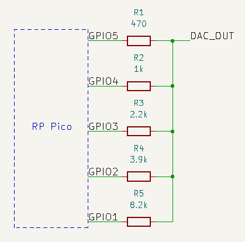
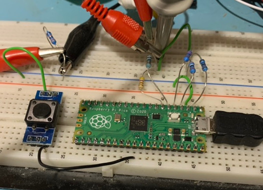

# sample output
Program to send data with 5 MHz to GPIOs. GP1 to GP5 is used, for bit 0 to bit 4.

# circuit diagram for 5 bit analog output

# test setup

# example output on a monitor with the test image

# TODO
- starting from GP0 doesn't work
- DMA stop code doesn't work
- Python script can be used only once after reset, looks like the DMA transfer messes up the USB transfer timing
